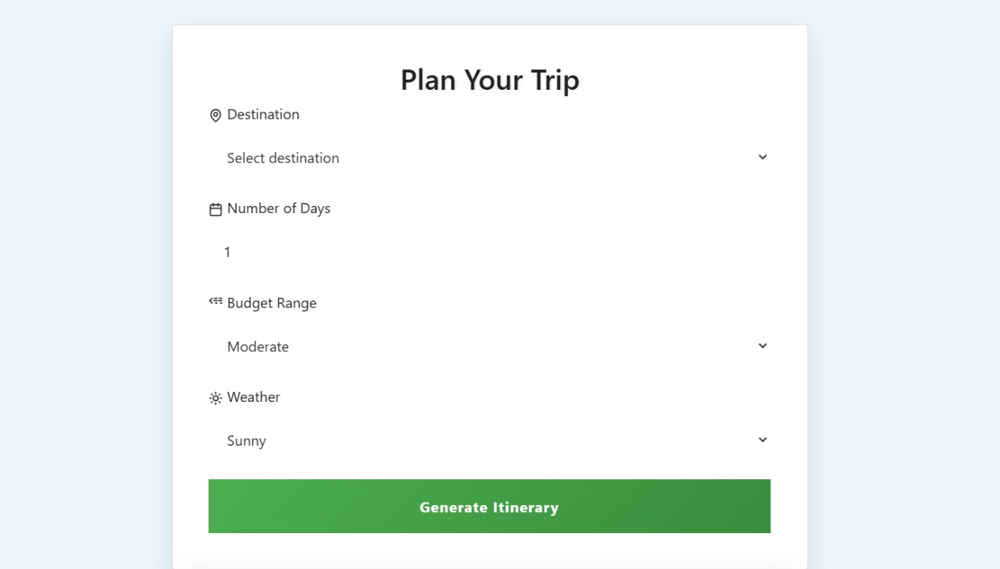
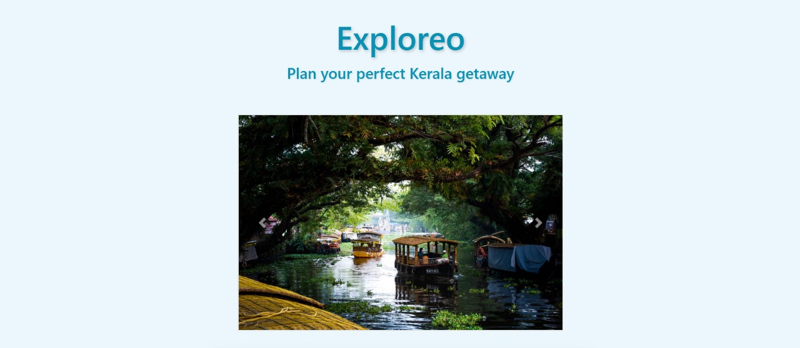
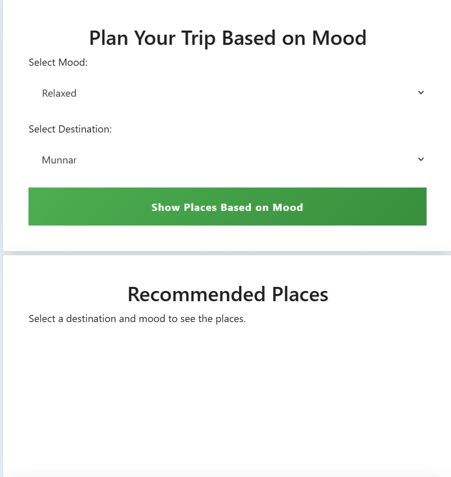
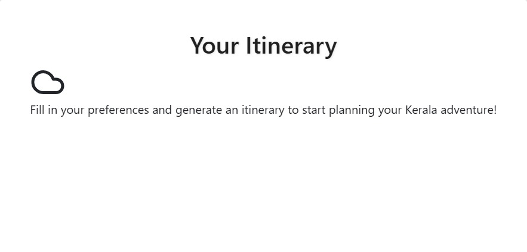

# [Exploreo] 🎯

## Basic Details
### Team Name: [Innovatrix]

### Team Members
- Member 1: [Shreya Susan Shibu] - [Amal Jyothi College of Engineering]
- Member 2: [Nithya Mariam Rajan] - [Amal Jyothi COllege of Engineering]
- Member 3: [Reema Elsa Shaji] - [Amal Jyothi College of Engineering]

### Hosted Project Link
https://exploreo-innovatrix.netlify.app/

### Project Description
Exploreo is a web-based application designed to create personalized travel itineraries for visitors to Kerala. Users provide key details such as their destination, the number of days, budget range, and travel mood (e.g., adventurous, historical, calm). Based on this information, the system generates a customized itinerary, suggesting both indoor and outdoor activities depending on real-time weather conditions.

The platform also offers recommendations for accommodations and dining options that align with the user's preferences. A built-in safety alert system helps travelers by identifying nearby police stations and providing emergency assistance information. By integrating Google Maps API and OpenWeather API, the app ensures a seamless and dynamic travel planning experience. The goal of this project is to enhance the travel experience in Kerala by offering a convenient, adaptive, and safe planning tool.

### The Problem statement
Travel planning can often be a tedious and overwhelming process, with the need to consider various factors like weather, budget, interests, and safety. Conventional itinerary generators often lack the flexibility to accommodate real-time conditions and personal preferences. For travelers visiting Kerala, there is an increasing demand for a personalized, adaptive, and safe trip planning solution that goes beyond generic suggestions.

### The Solution
Exploreo aims to address this gap by creating a smarter and more personalized travel planning tool. It provides users with a dynamic and customized itinerary based on their specific input (destination, number of days, budget, travel mood) while considering real-time weather conditions, activity preferences, and safety requirements. The system incorporates AI-powered recommendations for accommodations and dining, along with an integrated safety alert system to ensure the well-being of travelers.

## Technical Details
### Technologies/Components Used
For Software:
- HTML
- CSS
- Bootstrap
- Javascript

For Hardware:
- [List main components]
- [List specifications]
- [List tools required]

### Implementation
For Software:
# Installation
[commands]

# Run
[commands]

### Project Documentation
For Software:

# Screenshots (Add at least 3)

*Add caption explaining what this shows*

*Add caption explaining what this shows*

*Add caption explaining what this shows*

# Diagrams
[alt text](./diagram.png)

For Hardware:

# Schematic & Circuit

*Add caption explaining connections*

*Add caption explaining the schematic*

# Build Photos

*List out all components shown*

*Explain the build steps*

*Explain the final build*

### Project Demo
# Video
[Add your demo video link here]
*Explain what the video demonstrates*

# Additional Demos
[Add any extra demo materials/links]

## Team Contributions
- Nithya Mariam Rajan: CSS and Styling
- Reema Elsa Shaji: Design and responsiveness
- Shreya Susan Shibu: Data integration and implementation

---
Made with ❤️ at TinkerHub
